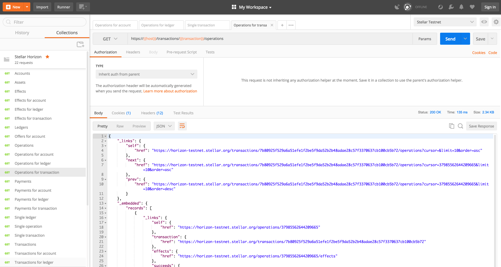
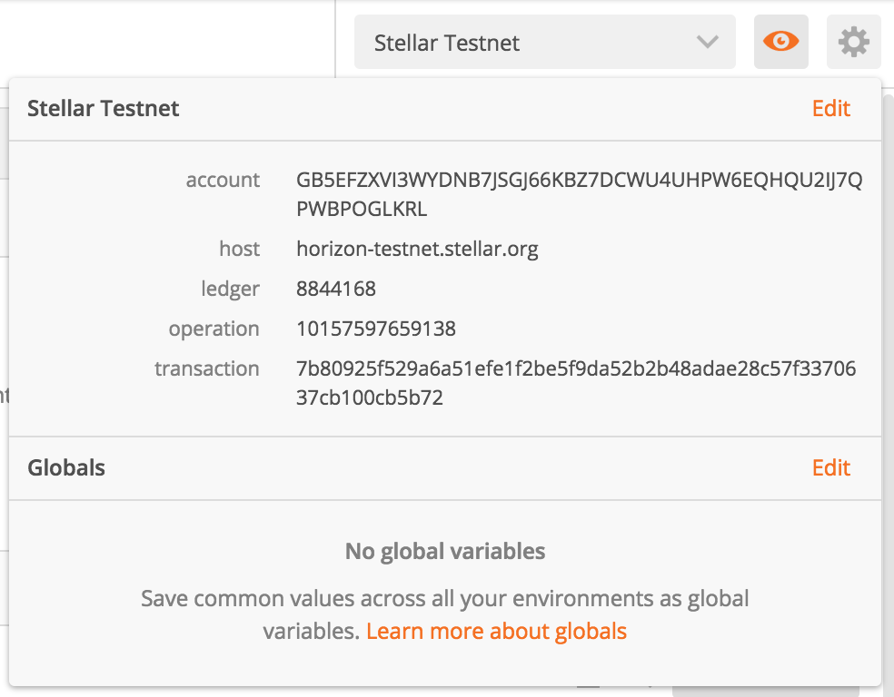
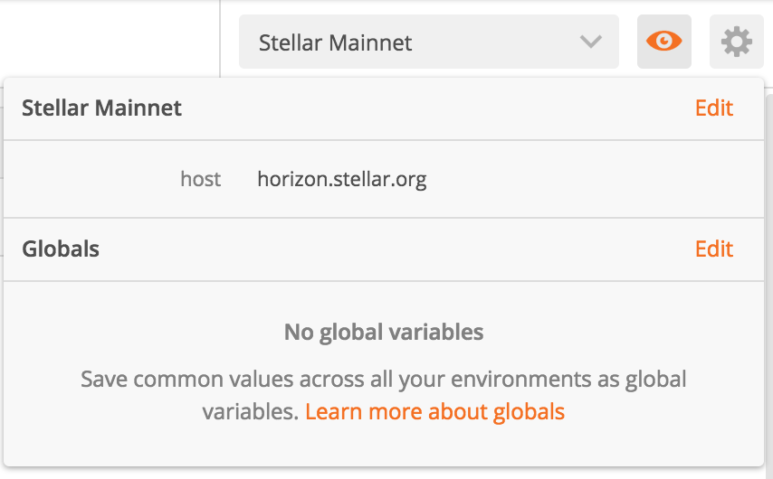

# Horizon Postman collection

This is a [Postman](https://www.getpostman.com) collection that includes most [Stellar Horizon](https://www.stellar.org/developers/horizon/reference/) endpoints.

## Usage

Import this collection into Postman via `File > Import` menu option, and import the `stellar-horizon.postman_collection.json` file in this repository. After that, create a couple - one for mainnet and another for testnet - of environments with variables called: `host`, `account`, `transaction`, `ledger`, and `operation`, they should look like:

You should be ready to browse to the endpoint you're interested in, and call Horizon in no time.
